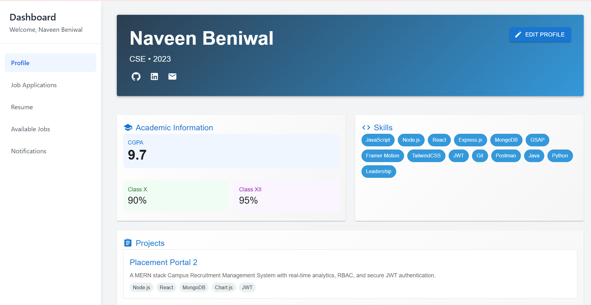
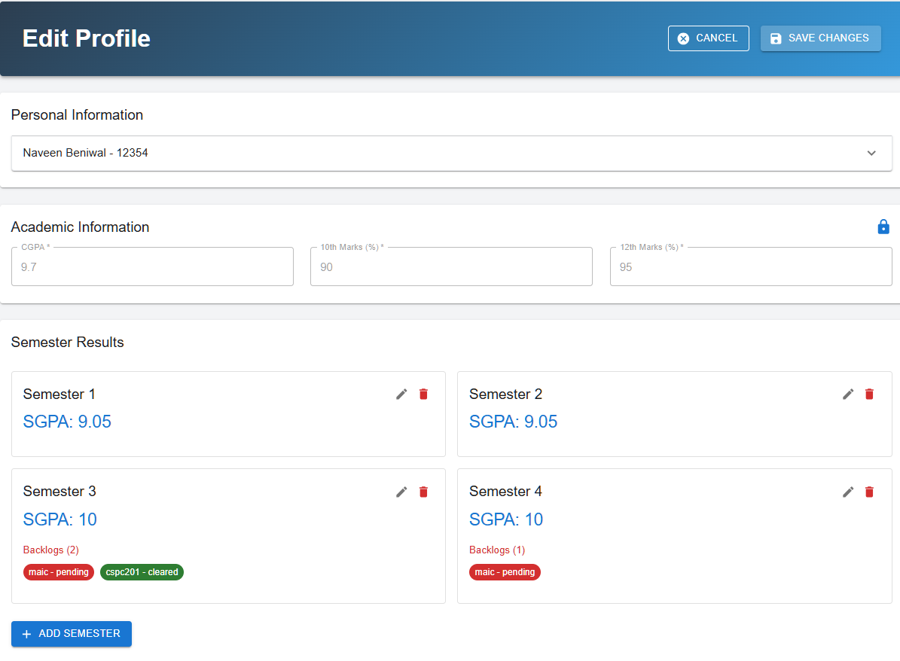
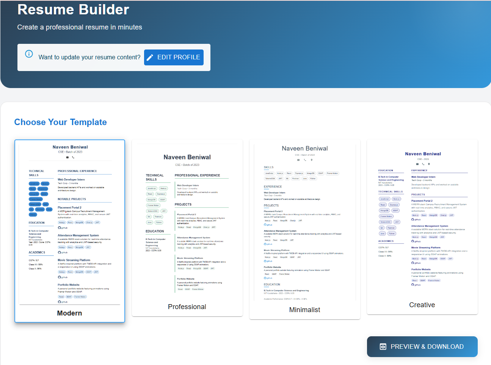

# 🎓 Campus Placement Portal - Student Dashboard

<div align="center">
  
  
  
  
  > Modern placement management system built with MERN stack
</div>

## ⚡ Quick Setup

### Backend
```bash
git clone https://github.com/Naveen-Beniwal/Student_Frontend.git
cd Student_Frontend/backend
npm install

# Create .env file with:
ACCESS_TOKEN_SECRET = 123
ACCESS_TOKEN_EXPIRY = 4d
REFRESH_TOKEN_SECRET = 123
REFRESH_TOKEN_EXPIRY = 7d
PORT = 3000
DATABASE_URL = "your_mongodb_url"

npm run dev
Frontend
bash
cd ../frontend
npm install
npm run dev

# Visit http://localhost:5173


🌟 Key Features
Profile Management
Resume builder with templates
Academic details tracking
Skills & achievements section
Profile completion tracker
Placement Activities
Real-time job notifications
Application tracking
Interview scheduler
Company-wise status
Analytics
Personal progress tracking
Placement statistics
Interactive dashboards
Performance metrics


🛠️ Tech Stack

Frontend: React.js, TailwindCSS, Chart.js

Backend: Node.js, Express.js, MongoDB

Authentication: JWT with refresh tokens

🤝 Support
For issues or queries, reach out at naveenbeniwal00001@gmail.com

Made with ❤️ by Naveen Beniwal
```
